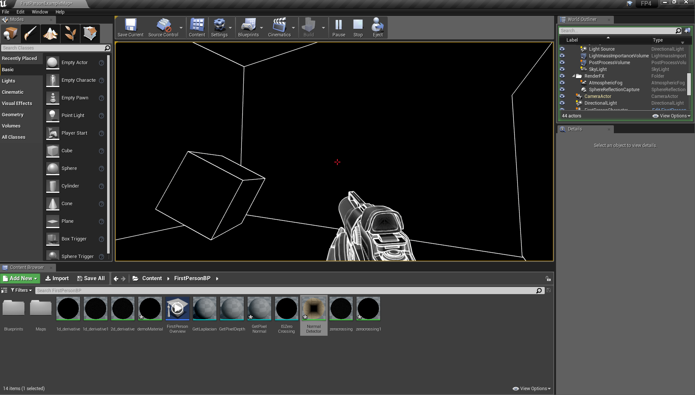

//a beginner's tutorial on how to achieve Antichamber style graphics in Unreal Engine 4 wherein I demonstrate the proper way to use the Laplacian operator and its superiority to 1st derivative filter kernels for edge detection. 

# How to achieve Antichamber style graphics in Unreal Engine 4

I wanted to recreate the Antichamber art style in Unreal (since Antichamber was made in Unreal). This turned out to be pretty easy and fun, so I thought I'd write it up as a tutorial. Keep in mind that when I wrote this tutorial I knew absolutely nothing about Unreal Engine, computer graphics or image processing (and now I know almost nothing). Caveat emptor, I guess. 

# Demo (Youtube video)

[](https://www.youtube.com/watch?v=9sQWwtV4Lgo)

# Main takeaways

- 2nd derivative operators like the Laplacian are superior to 1st derivative operators like the Sobel. 
- The proper way to use the Laplacian operator is to find the zero crossings NOT just the high values.
- Depth data is needed for exterior (outline) edges, whilst normal data is useful for interior edges. 
- Knowing some theory can be very useful ;)

# Step 1: obtain a white room

You may have noticed that Antichamber has an extreme case of the jaggies. I speculate that this was caused by the creator setting the postprocessing material's blendable location to be "after tonemapping" or "replacing the tonemapper" (either that or he forgot to turn on antialiasing in the project settings). Recall that if you implement a naive toon shader (e.g a laplacian or sobel edge detector) and set the blendable location of that post-processing material to either be "after tonemapping" or "replacing the tonemapper", you get jaggies - you only get antialiasing if you set the blendable location to be "before tonemapping" or earlier (the earlier the more expensive). 

Therefore you may ask, why don't we just use "before tonemapping" to get antialiasing? Well, the easiest way to implement totally white walls and objects in UE4 is to use emissive materials. However, if you do this naively, you will notice significant washout, i.e the edges are no longer thick black (as was the case when the blendable location was set to "after tonemapping") but are instead thin grey. In fact, the degree of "wash out" depends on how intense the emissive color is. At high intensities (e.g. 300) the entire room will be completely white - no edges visible! At yet, at low intensities (e.g 1) the wall does not look quite "white enough". In fact they look greyish and there is visible shading! Is there a solution?

Yes, this is easily solved by setting the material to be "unlit". You literally set the shading model of your wall material to "unlit". No more shading! Unfortunately, if you use an "unlit" material you find that you cannot access the WorldNormal information on that material anymore. I think this might be because Unreal uses lighting information to get the WorldNormal values, and on an unlit material there is no lighting information so it can't get the WorldNormals for it. So if you want to use WorldNormal information you can't use unlit materials, as far as I know. I think you could conceivably get the equivalent of WorldNormal information from depth information, but that's super inconvenient. 

So, we want to keep material's shader settings to default lit, but also keep the room completely white and get rid of ambient occlusion. You can get rid of ambient occlusion by setting it to 0 in the Post Process Volume settings. Now, one way to get rid of the greyness is to just disable the tonemapper, and there are multiple ways of doing this. One way of disabling the tonemapper is to create a new post processing material that consists of only a SceneTexture:PostProcessingInput0 node connected to Emissive Color, and set the blendable location of this material to "replacing the tonemapper". The other method is to go to the level blueprint and add 2 connected nodes: event beginplay and a console command (ShowFlag.Tonemapper 0). Disabling the tonemapper also gets rid of the glow from the emissive materials, which is what we want.  

Now, you may have noticed that any non-emissive materials in the room are completely black. This is because we've blocked the skylight with the ceiling. If you want color on objects, I think the easiest way is to use emissive colors. Alternatively you could use a directional light (you need to turn off cast shadows on the directional light). 

Summary:

Step 1. Make the material emissive white (alpha=1).  
  
Step 2. Disable tonemapping. Click on Blueprints -> Open Level Blueprint. Then create a Event Beginplay node connected to a Execute Console Command node with the following command: ShowFlag.Tonemapper 0  
  
Step 3. Remove ambient occlusion from PostProcessVolume.  
  

## Alternate, more detailed steps

1. Create a new UE4 project using the First Person blueprint template. 
2. Duplicate (ctrl-w) the floor and drag it up to make a ceiling. 
3. Create a new material (open it up in the material editor). Make it unlit. 
4. Create a constant 4-vector in the material editor, set it to white, and link it to Emissive Color. 
5. Close and save the new material.
6. Set the floor, ceiling, and walls of the level to use the new material. 
7. Create a new material. Make it post-process. 
8. Set its blendable location to "replacing the Tonemapper". 
9. In the material editor, create a SceneTexture Node and set its Scene Texture Id to PostProcessingInput0, then connect the Color output pin of this node to the Emissive Color input pin of the material node. 
10. Close and save the new material. 
11. In the Details panel of the PostProcessingVolume label (the one that comes with the template), add a new Asset reference in the Post Process Materials Array and choose the material we just created. 

# Step 2: Edge detection

If you don't know what edge detection is there is a nice introduction by computerphile [here](https://www.youtube.com/watch?v=uihBwtPIBxM). There is a nice tutorial for how to implement a sobel edge detection shader in UE4 [here](https://www.youtube.com/watch?v=TYhvqDSLU5g). This tutorial assumes that you have a passing familiarity with the concepts and methods discussed in that Youtube video - it shows you how to create post-processing materials better than I can explain via text and screenshots, so just watch it. 

## What information is needed?

You only __really__ need the depth information, but the surface normal information makes things much more convenient than if you had to use only depth. 

It is trivial to see that we can't use world normals alone for edge detection. If you create the following post process material and put it in the post process volume (you can disable the tonemapper using the trick I mentioned earlier if you want to, doesn't make much difference), then if you have walls and cubes set to a default lit material (like M_Basic_Floor) then you should see this:


What this shows is that whilst the faces of the cube each have a different worldnormal, if two faces are facing the same direction then they have the same worldnormal (represented as color in the image). Therefore, as you can see, since the cube is parallel to the wall, both the face of the cube facing the camera as well as the wall are green, which means there is no detectable edge between the face of the cube and the face of the wall. This means we cannot use world normal information alone for edge detection. 

But can we use depth information alone? If you try the laplacian depth-only edge detector from [this tutorial](https://raywenderlich.com/188499/unreal-engine-4-toon-outlines-tutorial), then it seems that sometimes it doesn't work. 


As you can see, the bottom edge of the cube, where it touches the ground, does not show up in the depth-only edge detector. However, there is no reason why this should be undetectable in principle. Recall that the Laplacian looks at the 2nd derivative. The 1st derivative of depth in the floor should be different from the 1st derivative of depth on the cube. This means as we move from the floor to the cube, there is a sudden change in 1st derivative, which should be captured by the 2nd derivative. So if you reduced the threshold you would see those edges detected properly. 


Everything looks perfect except for the spurious black lines on distant surfaces (those surfaces which experience a change in depth, e.g the floor). This is naturally because objects further away from the camera experience an increase in the 1st derivative - 2 neighboring pixels on the floor are much further apart when they are distant compared to when they are close to the camera. Therefore, we need some way of compensating for this. 

So, my first idea is to adjust the threshold (of the 2nd derivative) depending on depth, i.e the further away the object is, the higher the threshold should be, and vice versa. This was a simple multiplication by scene depth - threshold was directly proportional to scene depth. However the result was not quite what I wanted:

Before (using constant threshold):


After (using depth-proportional threshold):


As you can see, there is some improvement in that the closer-up edges are being drawn correctly whilst distant edges are more faded out. However, in the proportional case, you can see that the opposite wall corner edge is faded out, whilst at the same depth, there are still black artifacts. In the former case the detector isn't sensitive enough, yet in the latter case it is too sensitive - but both is happening at around the same distance from the camera. Since the oversensitivity and undersensitivity appear at the same depth, it clearly indicates to me that any method of modulating the threshold based on depth alone - regardless of whether proportional or some other nonlinear relationship - is not going to work. We need a different method. 

What about expanding the size of the kernel? Recall that the 3x3 laplacian kernel only takes into account one pixel to the left, right, top, and bottom. What if we use a 5x5 kernel, taking into account two pixels on each side instead of just one? Sure it will be slower, but it takes into account more information so would that help? Okay, so let's modify the code:


It doesn't work. Even if we tweak the threshold, it doesn't work. In fact it fails even harder than our previous attempt. Indeed, if we just think about what this kernel is doing, this isn't surprising. This 5x5 kernel amplifies the gradient change even more than the 3x3 kernel, so no wonder it is exacerbating the problems we had with the 3x3 kernel. 

Let's try a different 5x5 kernel:
```
+----+----+----+----+----+
|  0 |  0 | -1 |  0 |  0 |
|  0 | -1 | -2 | -1 |  0 |
| -1 | -2 | 16 | -2 | -1 |
|  0 | -1 | -2 | -1 |  0 |
|  0 |  0 | -1 |  0 |  0 |
+----+----+----+----+----+
```


Again, the result is worse than before, as expected. We need a fundamentally different method of edge detection. 

# A very brief introduction to edge detection

An edge is an instantaneous change in pixel intensity. Generally this is a "step" change meaning after a sudden change in direction, the new direction is unchanged for at least a few pixels. There's a good intro [here](http://www.aishack.in/tutorials/sobel-laplacian-edge-detectors/). Pixel intensity (whether in depth or normal) may be plotted as a curve. We can plot the first and second derivatives of this curve - an edge shows up as a spike on the 1st derivative graph and as a zero-crossing on the 2nd derivative graph. The 2nd derivative is more sensitive to noise (since differentiation amplifies noise), so smoothing (e.g using a Kuwahara filter) is advised prior to applying the 2nd derivative filters. 

1st derivative operators:

- Roberts cross (uses 2 2x2 kernels)
- Sobel (uses 2 3x3 kernels - horizontal and vertical)
- Prewitt (similar to Sobel)
- Frei-Chen (adaptation of Sobel filter, uses 9 kernels)

2nd derivative operators: 

- Laplacian. Only uses 1 kernel, which is an advantage over the 1st derivative operators listed above. 

Examples of possible Laplacian kernels:

```
0  1 0
1 -4 1
0  1 0

1  1 1
1 -8 1
1  1 1

-1 -2 -1
-2 12 -2
-1 -2 -1

-2 1 -2
 1 4  1
-2 1 -2
```

According to [these lecture notes](http://www.di.univr.it/documenti/OccorrenzaIns/matdid/matdid666794.pdf):

>Edge detectors based on first order derivative are not robust  
>– High sensitivity to noise, need a threshold  
>
>Second order derivative operators detect the edge at the zero-crossing of the second derivative → more robust, more precise  
>– Less sensitive to noise, **usually don’t need a threshold** for postprocessing of the contours image  

## Why zero crossings in the 2nd derivative?

This is super obvious, so feel free to skip this section unless you literally don't know any math. 

An edge is a sudden change in the direction of increase in intensity. Let's look again at a typical example:

```
Depth:
            Edge here
                v
[0, 1, 2, 3, 4, 5, 4, 3, 2, 1, 0]

1st derivative:

[1, 1, 1, 1, 1, -1, -1, -1, -1, -1]

2nd derivative:

[0, 0, 0, 0, -2, 0, 0, 0, 0]
```

As you can see, the edge is a sudden change in the 1st derivative, which is captured as a spike on the 2nd derivative. At this point you may be tempted to say that a sign change in the 1st derivative is all we need, however this is incorrect, as shown by this example:

```
Depth:
            Edge here
                v
[0, 1, 2, 3, 4, 5, 7, 9, 11, 13, 15]

1st derivative:

[1, 1, 1, 1, 1, 2, 2, 2, 2, 2]

2nd derivative:

[0, 0, 0, 0, 1, 0, 0, 0, 0]
```

As you can see here, there is an edge but no sign change in the 1st derivative. Hence, what we want is a sudden change in the 1st derivative, rather than a sign change. 

At this point you may be tempted to say that all we need to look for is high values in the 2nd derivative. But that is incorrect, because if the 1st derivative continually increases then we would keep seeing high 2nd derivatives but that is NOT an edge! Look at this example:

Depth:

[0, 1, 2, 4, 8, 16, 32, 64]

1st derivative:

[1, 1, 2, 4, 8, 16, 32]

2nd derivative:

[0, 1, 2, 4, 8, 16]

Here both the 1st and 2nd derivatives are rapidly increasing but that's not an edge! An edge is a **spike** in the first derivative, i.e the depth should be moving in one direction before the edge, and afterwards it should be moving in another direction - **a change in direction** i.e maxima and minima, which show up as zero crossings on the 2nd derivative. That's why we look for zero crossings (i.e sign change) in the 2nd derivative, not just high values in the 1st or 2nd derivative or zero crossings in the 1st derivative. 

Pretty simple. But why is this relevant? 

### Perspective distortion is asymptotic

I'm not going to prove this but you can think of a camera looking at the floor like this:


Rotate that a bit and you get this:


It's trivial to see that the equation governing the y intercepts of the red lines (with respect to the x intercepts of the green lines) is asymptotic, i.e they converge to a value (when the red line is parallel to the blue line). If you think about how perspective projection works (hint: apparent size is inversely proportional to distance) then I think you'll come to that conclusion. 

Now let's imagine what happens with the depth on the floor as we look "up". Thus we plot the visible vertical axis against actual distance. Here I plotted the asymptotic graph of the equation y = x/(1-x). Note that this is not based on real camera data, so it might be not be correct, this is just based on my layman's understanding of projective geometry:

 

Notice how the depth increases asymptotically (up to the vanishing point). Thus we end up with a series like this (this is taken from the asymptotic graph I plotted):

[42, 87, 136, 190, 250, 316, 389, 471, 563, 667, 786, 923]

Now, apply our kernel on the 1 dimensional image above:

[4, 5, 6, 6, 7, 9, 10, 12, 15, 18]

Wow! Would you look at that, as we near the vanishing point, the Laplacian rapidly increases, even though there are no edges. So, I think this explains the black artifacts that we saw earlier - it's caused by perspective distortion. The 2nd Laplacian increases due to perspective distortion, even where there is no edge. Since we now know that the curve is asymptotic, you might be tempted to ask for an asymptotic function for the threshold. However as mentioned before, using a scaling threshold doesn't work because we are operating directly on the magnitude of the 2nd derivative - from playing with the shaders earlier we already know that the magnitude of the Laplacian at a legitimate edge is dwarfed by perspective distortions of the floor (and other flat surfaces) given sufficient distance, which the screenshots from earlier showed is not very far in practice. 


## Detecting zero crossings in the 2nd derivative 

Okay, so now we know why thresholding on the magnitude of the Laplacian is a bad idea. In order to find edges, we want to find the zero-crossings of the 2nd derivative. After a bit of googling, it seems that the [full](http://me.umn.edu/courses/me5286/vision/Notes/2015/ME5286-Lecture7.pdf) [Laplacian edge detector](http://www.owlnet.rice.edu/~elec539/Projects97/morphjrks/laplacian.html) involves 4 steps:

1. Compute the LoG (Laplacian of Gaussian - first apply Gaussian smoothing for noise reduction, then compute the Laplacian over the smoothed image using a convolution filter. In our case we skip the smoothing step and directly apply the Laplacian.)
2. Look for places in the image where the Laplacian passes through zero i.e sign change. Do this by going through each row and each column of the Laplacian. 
3. Calculate the local gradient aka local variance aka the slope of the Laplacian through the zero crossing, taking only the crossings that exceed a certain threshold - we only want "strong" crossings. If you don't do this then you may pick up some minor ripples in the image as edges. 
4. Look at points on both sides of the boundary, and pick the one with the lower absolute magnitude as the edge since it should be closer to the zero crossing. If you don't apply this step the result will be biased either towards the lighter or darker side of the image. 

Steps 1, 2, and 3 are the most important. We only did step 1 now we need to do step 2. Question: Can we somehow combine steps 1 and 2? Seems it might be inefficient to do multiple passes, also, [this question](https://answers.unrealengine.com/questions/201488/are-multi-pass-shaders-on-single-objects-currently.html) and [this question](https://answers.unrealengine.com/questions/405257/how-to-fade-out-a-opaque-object.html) as well as the lack of any answers to [this question](https://answers.unrealengine.com/questions/376603/how-do-i-do-multiple-passes-in-my-post-processing.html) seem to suggest that there isn't really a way to do multiple passes in Unreal Engine. So, let's try to figure out if there's a way to compute both the Laplacian and detect zero-crossings in the Laplacian in a single pass (in a post process material). 

This [lecture slide](http://www.di.univr.it/documenti/OccorrenzaIns/matdid/matdid666794.pdf) suggests the following approach:

>Practical solution: form the maximum of all positive Laplacian responses and the minimum of all Laplacian responses in a 3x3 window. If the difference between the two exceeds a threshold an edge is assumed to be present.

So, spoiler alert, when I actually tried to implement this, compiling the shaders took so long that it crashed my computer. In fact, merely saving and then opening the shader material was enough to crash my computer (to be fair, I was using the Linux version of Unreal Editor). 

# Implementing the depth-based edge detector

We're going to start with depth and add in the normals shader later. Since normals can detect all the interior edges we only need the depth shader to detect the exterior edges (those that can't be detected by the normal shader). 

Let's go back to the original shader from [here](https://www.youtube.com/watch?v=TYhvqDSLU5g). The Prewitt operator is made up of two 3x3 kernels:

x:  
-1 0 1  
-1 0 1  
-1 0 1  
y:  
-1 -1 -1   
0  0  0  
1  1  1  

Let's use a simplified version of this to begin with:

x: -1 0 1  
y:  
-1  
0  
1  

So what this kernel does is it simply subtracts the next pixel depth from the previous pixel's depth (or vice versa) - very simply calculating the 1st derivative. 

So to implement this, we first want a GetPixelDepth function, like this:


Now we can create a post process material where we simply plug 2 of these together to get a 1 dimensional derivative, like this:


Now add this to post process volume and we see the result:


Notice how we only see lines on the right hand side of the objects. This is because the very negative values don't show up (or are too dark to see). So we want to use the abs node to see lines on both sides of an object:


The result:


So, as you can see there is a bunch of gradients all over the place, which we don't want. We just want thin lines for edges. So let's add a threshold for depth differential:


As you can see there is some jaggies and shimmering going on. This is caused by the TemporalAA (if you use the other anti-aliasing options you don't get shimmering). To get rid of shimmering you need to set the post process material's blendable location to "before tonemapping" as mentioned before. So let's see how well it performs now that we've fixed the shimmering:


It fails. As you can see in the image, with a threshold set at 150, some of the exterior edges of the cubes were not showing up, but at the same time some artifacts were still visible at certain camera angles. So I think this is a good demonstration of why 1st derivative operators fail: because the derivative can become very high when there is a long surface at a steep angle to the camera, so you'd need to set the threshold so high that some exterior edges don't show up in order to get rid of these artifacts. 

But in the Youtube video the guy from Certain Things Studios made a Sobel edge detection shader and it worked perfectly without these artifacts. So, something seems weird here. Let's have a look at exactly what the "Sobel" edge detection shader in the Youtube video was doing:


So this is a tree with a root which is an addition node, which has 2 children each of which are also addition nodes. Now these 2 children are analogous so let's look at the top child, which is a tree that translates to this:

(getPixelDepth(0,0) - getPixelDepth(1,0)) + (getPixelDepth(0,0) - getPixelDepth(-1,0))

Which is equivalent to:

getPixelDepth(0,0) - getPixelDepth(1,0) + (getPixelDepth(0,0) - getPixelDepth(-1,0)

Which simplifies to:

2 * getPixelDepth(0,0) - getPixelDepth(1,0) - getPixelDepth(-1,0)

Now what does that remind you of? That's right, **it's the 1 dimensional Laplacian operator**! So in fact, although this guy said he was implementing the Sobel operator, he ended up implementing the Laplacian operator instead! No wonder it was working so well. And here I was thinking maybe 1st derivative filters are better than 2nd derivative...Nope. The 2nd derivative works better. Also, we're supposed to look for **strong zero crossings** in the 2nd derivative, not just high values in the 2nd derivative... Pretty amazing that it works despite all that though, huh? Okay, so let's implement the 1 dimensional Laplacian operator instead of the Prewitt operator that we're using:


And the results:


It fails. Not as bad as the 1st derivative operator, but still has artifacts. I found that the highest the threshold parameter could be set to was around 20 (beyond that and some exterior edges might not show up in some common cases). But you need the threshold parameter to be around 60 to get rid of all artifacts in the scene. Again as before I tried making the threshold proportional to depth, didn't help - the problem is fundamentally due to perspective distortion, at any given depth the minimum threshold required to not get the artifact to show up will be higher than the maximum threshold to get the legitimate edges to show up, in other words there is no function using only depth that can be used to set the threshold. Again this is consistent with what I said earlier about the nature of perspective distortion. 

## The secret sauce - implementing the zero crossing detector

So, let's try out the zero crossing idea now. First let's fix GetPixelDepth:


Now, let's add some logic to detect if 2 laplacians form a zero crossing:


As you can see, there are two 1-dimensional laplacians here, one centered around the (0,0) pixel and the other centered around the (1,0) pixel (thus its neighboring pixels are 0,0 and 2,0). The laplacians are fed into 2 nodes, a multiplication node and a subtraction node. The multiplication path is a binary check to see if the two laplacians constitute a zero crossing - if the result is negative, then exactly one of the inputs are negative and the other is positive, indicating a zero crossing (sign change). The subtraction path is a threshold check to see if the crossing is "strong enough" i.e the difference between the 2 laplacians is big enough (a threshold value of 10 was determined to be good by trial and error). Outputting 1 if it passes the test and 0 otherwise, we multiply the results of these 2 tests - it's the same as an AND operation, i.e both conditions must be true in order to output 1 i.e that there is an edge at that pixel. You need the subtraction path otherwise you will see spurious lines all over the place. 

So, let's look at the results:


As you can see, the artifact from before is totally gone now. At the same time, I extensively tested the shader by moving around, looking at the same objects from different angles at different distances and found that exterior edges are always reliably drawn at a threshold of 10. Caveat: this may only apply to the particular room and props I was using, if you have a very large landscape it may fuck up. But I'm not planning to use it for large landscapes so this is fine for my purposes. Also it might only work for objects with only flat surfaces like cubes and might not work for rounder objects - again this is not really my concern, but when I tested it on spheres it worked correctly. 

As you may have noticed, we can reuse some nodes here, maybe that will improve performance. I would have liked to make these materials in C++ but I looked online and [it seems there's no way to do that](https://www.reddit.com/r/unrealengine/comments/2iu9yq/coding_a_material_from_scratch/). So you'll have to live with the spaghetti code for the rest of this tutorial. 

One major problem you may have noticed from the previous screenshot is that the lines are no longer clean as compared to before. Recall that when we were using just the threshold method, we had clean edges. But after we switched to the zero crossing method, the lines are no longer clean. What the hell is going on?

I suspect this had something to do with the abs node that I used. Let's see what happens if I remove it:


And the result:


And if we switch over the connections on the subtraction:


As you can see, switching the direction of the subtraction changes the edge detector from drawing smooth right edges to drawing smooth left edges. Basically the one-sided detector only reliably detects those edges which are going from low to high depth (in the specified direction). I don't really know what causes the dirty lines on the other side, increasing the threshold didn't get rid of them - I guess there is some theory here that I don't know T_T (why didn't I take the computer graphics and image processing classes). So what I figured is, I would first get rid of the dirty lines and then combine the smooth lines to form the 2 sided edge detector. But how do we get rid of the dirty lines? 

Idea: Since the dirty lines are only on the opposite of the clean edge, we'll determine whether a pixel is on the clean or dirty edge using some test, and then if that test fails we'll simply refuse to draw the pixel. So we'll determine if the pixel is at a background-to-foreground edge, or vice versa, and we can do that by looking at the difference between the depths of the pixels at (-1,0) and (2,0). So for our single-direction edge detector, this way we'll be able to keep the clean edge on one side whilst getting rid of the dirty edge on the other side: 


And the results:


Wow! Clean lines! Everything is looking good. Now all we have to do is combine 4 of these together. So, our existing condition looks like this:

`if difference_of_laplacians > 10 && difference_of_depths < 0, then draw the pixel.`

So to highlight the pixel on the other side, we simply have to reverse the condition to get:

`if difference_of_laplacians < -10 && difference_of_depths > 0, then draw the pixel.`

And we want to combine these 2 conditions using an OR operator, so here we'll just add then clamp:


I appreciate that the code is becoming a little bit more spaghetti-like, but I want to keep things simple for now (don't want to introduce too many obscure material functions that might be harder to understand or increase compile times to the point of crashing my poor computer again). Keeping all the logic in one page is good for understanding, I think. Anyways, results:


Works as expected. Some of the weaker edges are not captured very well, but that's fine - we'll capture those with the WorldNormal detector later on. For now, let's test to see how well it works in 2 dimensions. To do this, we'll just copy what we currently have and just change the input vectors then combine the 2 with another add and clamp (resulting in yet more spaghetti code):


Now let's see how well it performs:


It works! Jumping around the map shows no artifacts and all the exterior edges are detected cleanly. The weaker edges aren't being picked up as mentioned before and now we'll fix them. We'll do this by adding a simple WorldNormal detector. 

# Implementing the normal-based edge detector

Now, since WorldNormal, unlike depth, is an unchanging value on any flat surface, regardless of which way the camera is pointing (so you may notice that as you move the camera around, the depth value of a surface changes but its WorldNormal does not), this means a simple 1st derivative edge detector will do. The advantage of the WorldNormal detector over the depth detector is that the normal-detected edge between 2 surfaces will always be clean and the magnitude will always be the same regardless of distance from the camera, with a normal detector you won't get things like if you move too far away then the edge disappears. 

So, the 1st derivative is just the difference between the WorldNormal values of two neighboring pixels. We can actually just look to see if this value is nonzero for flat surfaces since the normals are constant - obviously you need to use a slightly more sophisticated method for curved surfaces. Since this detector is so straightforward I will skip the 1-dimensional version and just present the final 2-dimensional normal-based edge detector here:


So here we simply get the x and y absolute normal difference and just add them up. Result:



Looks perfect except for some edges that cannot be captured by normals-based edge detection, and that's where the depth based edge detector comes in. Time to combine the two. 

# Combining the depth-based and normal-based edge detectors

This one is straightforward. Simply copy and paste one into the other and combine them with a max node:


And we're done! This is the post processing material used for the Youtube video demo. There is probably some room for optimization but it seems fast enough for my purposes so I didn't bother. Also the blueprint could be cleaned up/decomposed etc. 